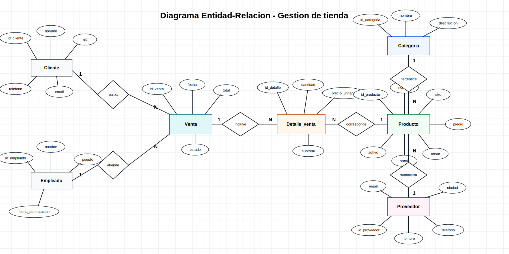

# Proyecto BD - Diseño de base de datos

Repositorio dedicado a la parte de diseño del Proyecto 2 de Bases de Datos. El sistema modelado corresponde a una tienda que administra productos, categorias, proveedores, clientes, empleados, ventas y detalle de ventas.

## Diagrama entidad-relacion

El diagrama usa notacion Chen:

- Entidades en rectangulos.
- Atributos en ovalos.
- Relaciones en rombos.
- Cardinalidades `1` y `N` sobre las lineas.




## Entidades principales

- `Cliente`: persona que realiza compras.
- `Empleado`: persona que atiende ventas.
- `Venta`: encabezado de una compra.
- `Detalle_venta`: productos incluidos en una venta.
- `Producto`: articulo vendido por la tienda.
- `Categoria`: clasificacion de productos.
- `Proveedor`: empresa o persona que suministra productos.

## Relaciones principales

- Un cliente realiza muchas ventas.
- Un empleado atiende muchas ventas.
- Una venta incluye muchos detalles de venta.
- Cada detalle corresponde a un producto.
- Una categoria agrupa muchos productos.
- Un proveedor suministra muchos productos.

## Scripts SQL

Los scripts estan preparados para PostgreSQL y deben ejecutarse en este orden:

```bash
psql -U proy2 -d tienda_db -f sql/01_ddl.sql
psql -U proy2 -d tienda_db -f sql/02_datos_prueba.sql
psql -U proy2 -d tienda_db -f sql/03_indices.sql
```
